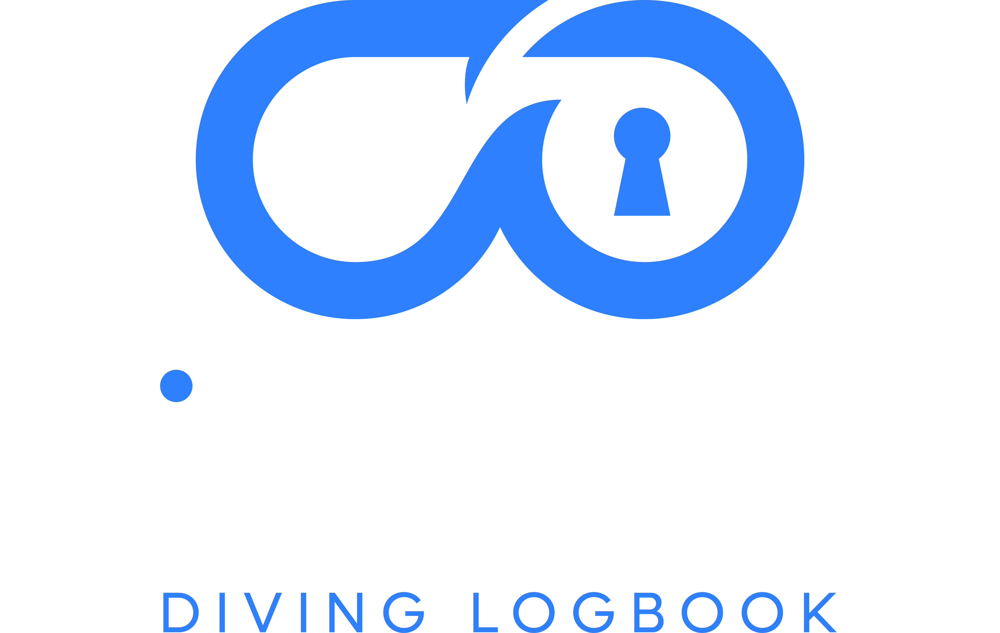

<p align="center">
  
</p>

<h1 align="center">DiveVault Importer</h1>

<p align="center">
  Companion desktop importer for syncing dive computer telemetry into DiveVault.
</p>

<p align="center">
  
  
  
  
  
</p>

<p align="center">
  <a href="#quick-start">Quick Start</a> |
  <a href="#building-the-gui-app">Build GUI</a> |
  <a href="#what-the-importer-does">What It Does</a> |
  <a href="#features">Features</a> |
  <a href="#workflow-overview">Workflow</a> |
  <a href="#contributing">Contributing</a> |
  <a href="#license">License</a>
</p>

---

DiveVault Importer is the desktop side of the DiveVault system. It detects a supported dive computer, reads dive telemetry through `libdivecomputer`, and uploads parsed dives to the DiveVault backend.

The importer is currently centered around the Mares Smart Air over serial transport. The GUI handles device selection, port scanning, browser-based backend sign-in, and sync progress.

## Quick Start

Create a virtual environment and install dependencies:

```powershell
python -m venv .venv
.\.venv\Scripts\Activate.ps1
python -m pip install --upgrade pip
python -m pip install -r requirements.txt
python scripts/fetch_libdivecomputer.py
```

Run the importer:

```powershell
python divevault-importer.py
```

The bootstrap script downloads the upstream `libdivecomputer-0.9.0` source and prepares runtime files for the current platform.

## Building The GUI App

Install build dependencies:

```powershell
python -m pip install -r requirements.txt -r requirements-build.txt
```

Build the packaged desktop app:

```powershell
python scripts/build_gui.py
```

The build is script-driven. `DiveSync.spec` is generated by PyInstaller when needed and is not kept in source control.

The GitHub Actions workflow in `.github/workflows/build-gui.yml` builds Windows, Linux, and macOS artifacts. On Windows, the runtime dependencies are built from source with the same MinGW-oriented approach used by the upstream `libdivecomputer` project workflow.

## What The Importer Does

- Detects compatible serial-connected dive computers
- Uses `libdivecomputer` to read raw dive data, metadata, and samples
- Uploads parsed dive records to DiveVault
- Stores and reuses device sync state so later syncs only import newer dives
- Uses browser approval for desktop sync authentication
- Packages as a desktop GUI with bundled runtime assets and translations

## Features

- Desktop GUI for hardware selection, backend sign-in, and synchronization
- Support for persisted backend URL, device model, serial port, and language settings
- Localized UI bundles for English, German, and French
- Windows application icon and bundled DiveVault visual assets
- Runtime bootstrap scripts for `libdivecomputer`
- GitHub Actions packaging for release artifacts

## Workflow Overview

### Import Workflow

- Select the dive computer brand and model
- Scan serial ports until the device is detected
- Sign in to the DiveVault backend through the browser approval flow
- Start synchronization from the desktop app
- DiveVault stores uploaded dives for review, completion, and logbook use

### Backend Contract

The importer talks to the DiveVault backend APIs:

- `/api/device-state` to fetch and update per-device sync checkpoints
- `/api/dives` to upload parsed dive records
- `/api/cli-auth/request` for desktop login approval

Backend storage, authentication, and API behavior belong in the main DiveVault repository:

- <https://github.com/jLemmings/DiveVault>

### Runtime Responsibilities

- Prepare or locate the `libdivecomputer` runtime library
- Locate serial ports and confirm the selected device descriptor
- Parse telemetry into DiveVault-compatible payloads
- Keep the packaged app self-contained for end users

## Project Structure

- `divevault-importer.py`: main application and GUI entrypoint
- `assets/`: application icons and README/UI logo assets
- `translations/`: JSON translation catalogs for the desktop UI
- `scripts/build_gui.py`: PyInstaller build script and packaging source of truth
- `scripts/fetch_libdivecomputer.py`: downloads upstream `libdivecomputer` source/runtime files
- `scripts/build_libdivecomputer.py`: rebuilds the runtime locally for the current platform
- `scripts/build_libdivecomputer_windows.sh`: MinGW-based Windows runtime build script
- `scripts/build_libdivecomputer_windows.ps1`: PowerShell wrapper for Git Bash or MSYS2 Bash
- `vendor/libdivecomputer-0.9.0/`: local bootstrap directory for downloaded source/runtime files
- `VERSION`: app version used by the GUI and release workflow

## Contributing

Start by running the importer locally end to end before changing code. Hardware and runtime-library behavior can vary by platform, so keep changes small and verify the affected workflow.

### Requirements

- Python 3.12+
- Tkinter
- A supported serial-connected dive computer
- `libdivecomputer` runtime files prepared by the bootstrap scripts
- On Windows runtime rebuilds: Git Bash or MSYS2 with `bash`, `autoreconf`, `make`, and `x86_64-w64-mingw32-*` tools

### Local Checks

```powershell
python -m compileall divevault-importer.py scripts\build_gui.py scripts\fetch_libdivecomputer.py
```

Build checks:

```powershell
python scripts\build_gui.py
```

If PowerShell resolves `bash` to WSL instead of Git Bash or MSYS2, use the wrapper script:

```powershell
powershell -ExecutionPolicy Bypass -File .\scripts\build_libdivecomputer_windows.ps1
```

To rebuild the runtime locally without changing packaging:

```powershell
python scripts\build_libdivecomputer.py
```

To force a clean rebuild:

```powershell
python scripts\build_libdivecomputer.py --force
```

## Related Repositories

- Main DiveVault app and backend: <https://github.com/jLemmings/DiveVault>
- Helm chart repository: <https://github.com/jLemmings/helm-charts>

## Related Upstream

This project relies on `libdivecomputer` for low-level dive computer communication and parsing.

- Project site: <https://www.libdivecomputer.org/>
- Source repository: <https://github.com/libdivecomputer/libdivecomputer>

## License

This project is licensed under the GNU General Public License v3.0. See [`LICENSE`](./LICENSE) for details.
